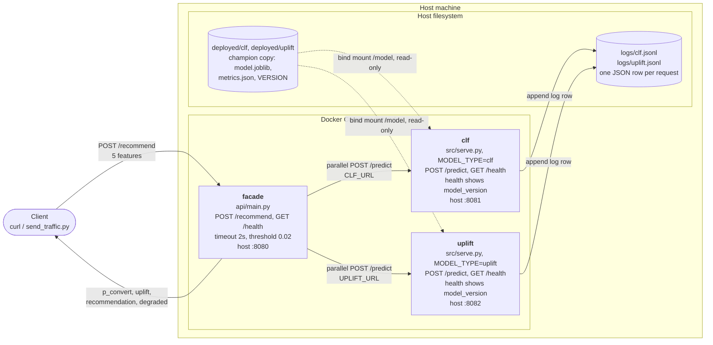
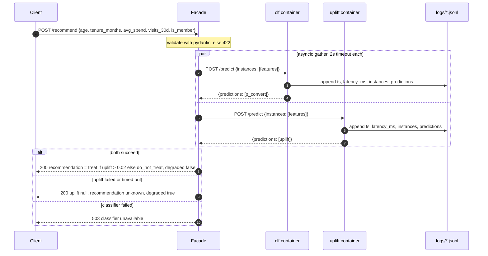
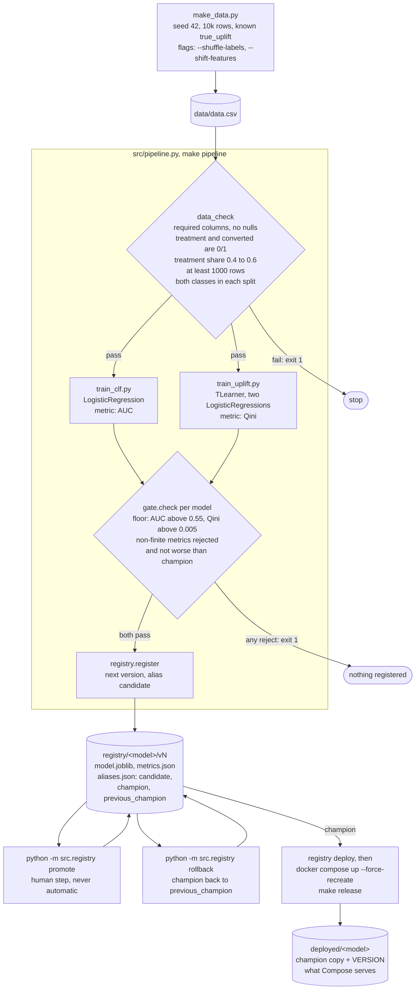
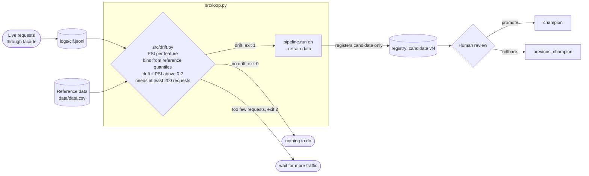
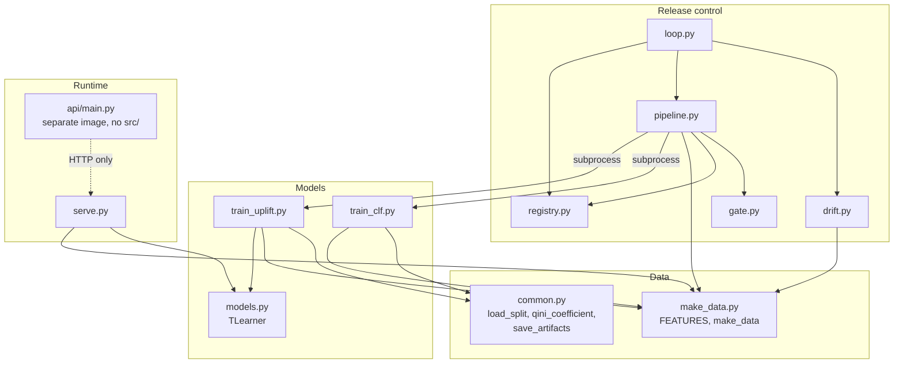
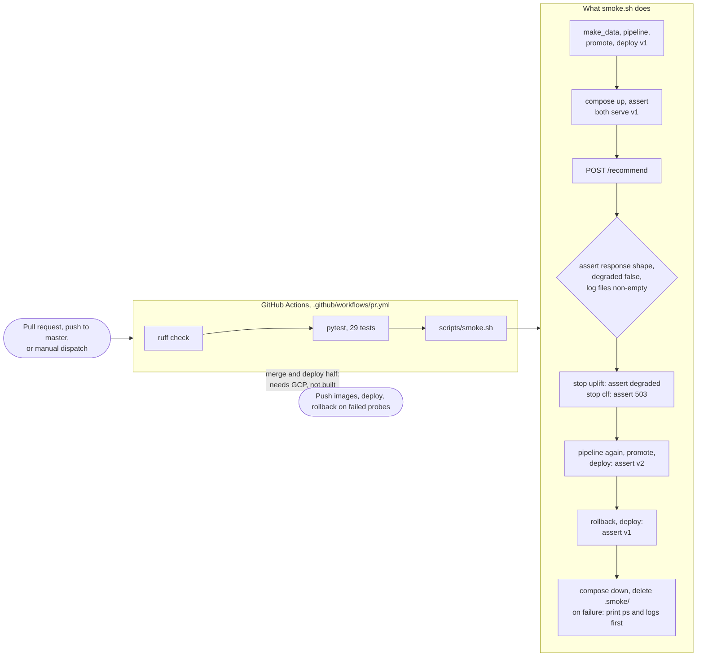
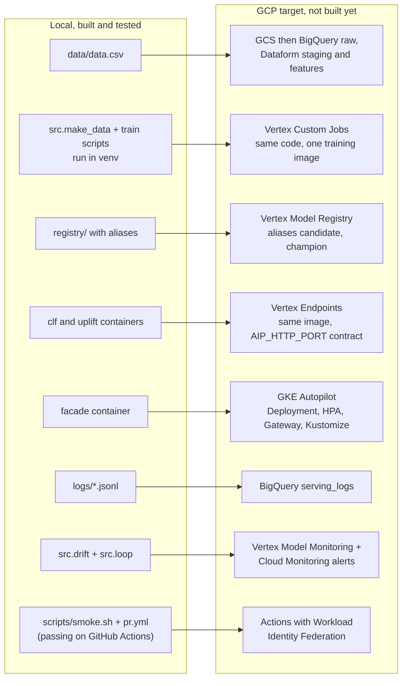

# Architecture

Diagrams of the local setup as built and verified, plus the cloud target it maps to. Render in any Mermaid viewer (GitHub, VS Code Markdown preview).

## 1. Local runtime (Docker Compose)

Three containers on one Compose network. Only the facade is meant for callers; the model ports are published on 127.0.0.1 for debugging.

## 2. One request, including failure paths

## 3. Model lifecycle: train, gate, register, promote, deploy

The pipeline is all-or-nothing: both models register or neither does, because they are served together. Serving only changes when `make release` runs, so promote and rollback are decisions and release is the action. Check what is live with `curl localhost:8081/health`.

## 4. Drift and the retraining loop

Loop exit codes: 0 no drift, 1 drift and a candidate was registered, 2 could not run (too little traffic, bad data, crash), 3 drift but the pipeline rejected the retrain. Pipeline exit codes: 0 registered a candidate, 1 gate rejected, 2 could not run. Drift is measured with PSI; binary features use one bin per value, since quantile bins collapse for them.

## 5. Code map

Real logic lives in `src/`. The serving image and the training scripts import the same modules. Arrows are the actual `import` statements; `pipeline` reaches the training scripts by subprocess.

## 6. Delivery: the CI workflow

## 7. Local to cloud mapping

What each local piece becomes on GCP (Plan.md). Only the local column exists today. The CI workflow runs on GitHub, but only the local checks, not any deploy.

